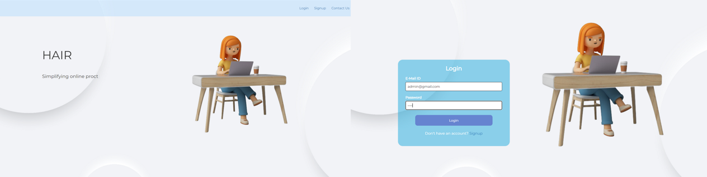
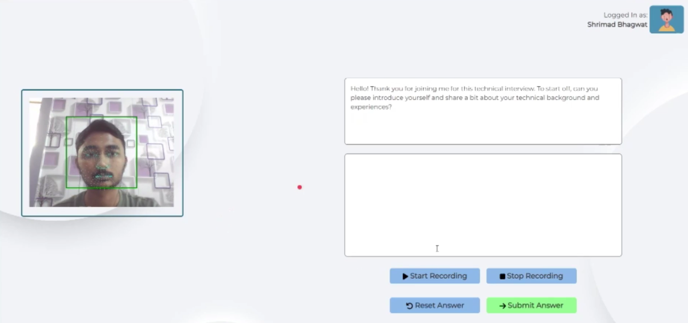

# HAIR - AI Proctored Interview System 🎓🤖

Welcome to the HAIR (Automated AI Interview System) project! This web application is designed to streamline interview practice sessions and conduct interviews with the help of AI technology.

## 📸 Project Screenshots

## ✨ Features

- **🔐 Login/Sign up:** Users can easily create accounts and log in to access the platform.
- **📝 Proctored Quiz:** The system offers quizzes with proctoring mechanisms to ensure integrity.
- **🎤 AI-Powered Interview:** Engage in interview simulations with an AI interviewer, complete with facial detection and speech-to-text features.
- **👁️ Face and Eye Detection:** The application uses advanced facial detection technology to monitor users during interviews and quizzes.
- **🗣️ Speech-to-Text Recognition:** AI modules transcribe spoken responses during interviews, providing real-time feedback.

## 🚀 Usage

1. **Sign Up / Login:** Start by creating an account or logging in.
2. **Dashboard Navigation:** Access the dashboard to manage your profile, start quizzes, or initiate an interview.
3. **Start an Interview:** Choose the AI Interview option to begin your practice or real interview session.
4. **Receive Feedback:** Review AI-generated feedback on your performance.

## 💻 Technologies Used

- **Frontend:** HTML, CSS, React, Bootstrap
- **Backend:** Node.js, Express.js
- **Database:** MongoDB
- **AI/ML:** TensorFlow COCO SSD (Common Objects in Context Single Shot Multibox Detector), WebGazer (Eye Tracking)
- **LLM used:** OpenAI api
  
## 🙌 Contributing

We welcome contributions to this project! Please fork the repository and submit a pull request with your improvements or new features.
